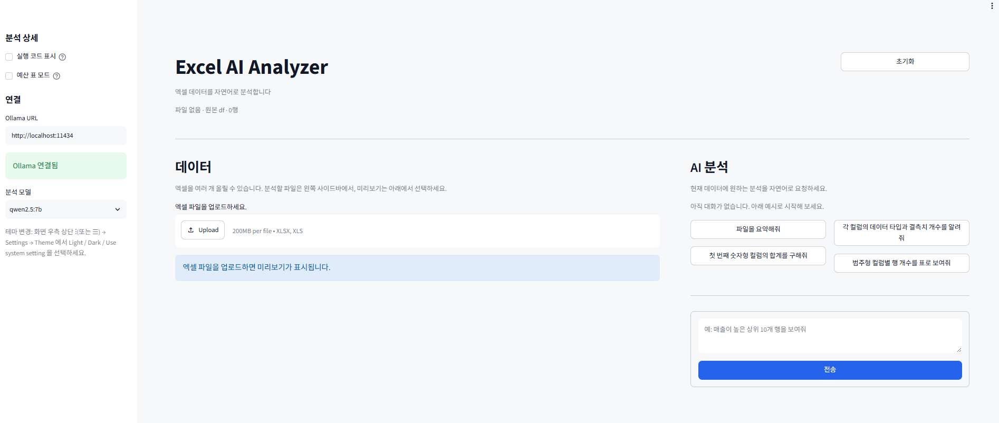
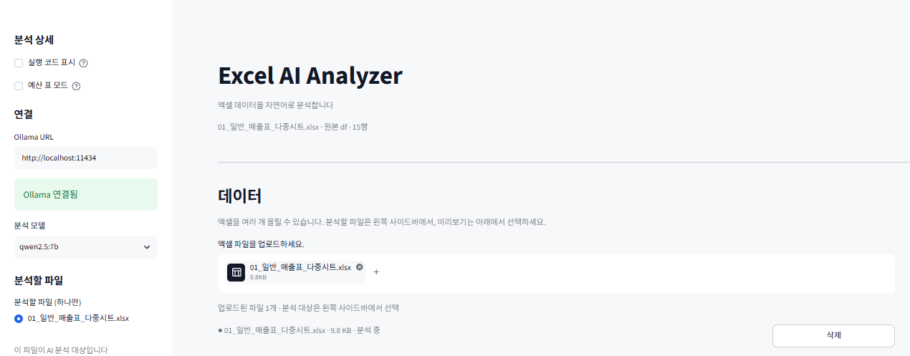
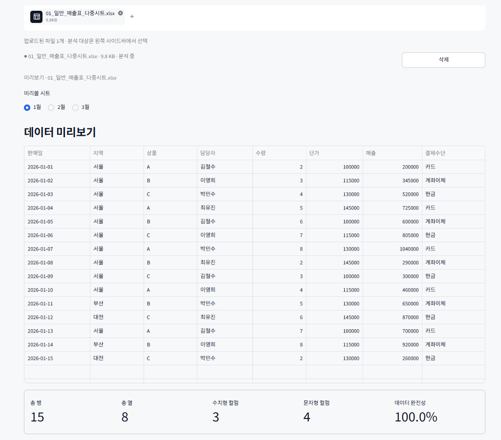
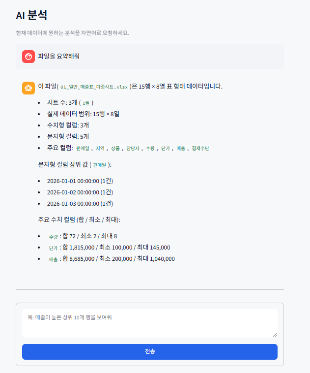
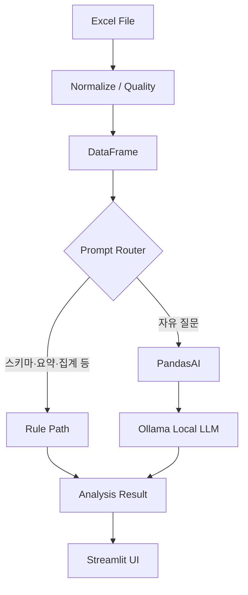

# Excel AI Analyzer

> Upload Excel files and analyze them using natural language with Local LLM.

## 프로젝트 소개

본 프로젝트는 다양한 Excel 표를 자연어로 조회·집계·시각화할 수 있는 **준범용** 분석 도구입니다.  
핵심 데이터 처리 구조는 도메인에 독립적이지만, 현재 기본 프로필과 예시, 일부 의미 규칙은 한국 연구과제 **예실대비표**에 맞춰 최적화되어 있습니다. 예산 심화 요약·하단 footer 제외 등은 사이드바의 **예산 표 모드**에서만 켭니다.

복잡한 함수나 피벗 테이블을 직접 만들지 않아도, 파일을 업로드한 뒤 질문만 입력하면 데이터 탐색·요약·집계를 진행할 수 있습니다.

- 해결하려는 문제: 엑셀 분석에 필요한 반복 작업과 높은 진입장벽
- 사용자가 할 수 있는 것: 업로드, 시트 선택, 미리보기, 자연어 질의, 결과 확인
- 분석 엔진: **규칙 라우팅 + PandasAI + Ollama** (스키마·요약·집계는 규칙 경로, 자유 질문은 LLM)
- UI: **Streamlit** 기반 인터랙티브 웹 화면
- 모드: **일반 분석(기본)** / **예산 표 모드(예실대비표)**

## Preview

### 🏠 메인 화면


### 📂 파일 업로드


### 👀 데이터 미리보기


### 🤖 AI 분석 결과


## 주요 기능 (Features)

| Feature | Description |
| --- | --- |
| Excel Upload | `xlsx/xls` 파일 업로드 지원 |
| Multi File | 여러 파일 동시 업로드 및 파일별 분석 |
| Multi Sheet | 시트 선택 후 원하는 데이터 분석 |
| Multi File × Sheet | 동시 분석 모드에서 파일별 시트를 여러 개 골라 시트 단위로 펼쳐 비교 |
| Data Preview | 업로드 데이터 미리보기 및 기본 요약 |
| AI Chat Analysis | 자연어 질문으로 필터·리스트·집계 분석 |
| Summary Command | `파일을 요약해줘` 명령으로 빠른 요약 |
| Schema Compare | 컬럼 목록·공통 컬럼·dtype/결측·타입 분류 등 스키마 비교 |
| Suggested Prompts | 업로드 컬럼 기반 추천 질문 자동 생성 |
| HTML Table Result | 분석 결과를 표 형태로 출력 |
| Bar Chart Render | 집계 결과 기반 막대 차트 생성 |
| Local LLM | Ollama 로컬 모델 연동 |
| Native Theme | Streamlit 설정(☰)에서 Light / Dark 전환 |
| Code Guardrails | 생성된 분석 코드 점검·재시도, 사이드바에서 실행 코드 표시 |
| Input Normalize | 컬럼명·타입 정규화로 다양한 엑셀 형식 흡수 |
| Quality Report | 결측/중복/혼합타입 등 품질 경고·가이드 |
| File Merge Export | 공통 키 기준 N개 파일 병합 후 xlsx 다운로드 |
| Budget Table Mode | 예실대비표 전용 요약·footer 행 제외 (옵트인) |

## Architecture



## Tech Stack

- **Frontend**
  - Streamlit (네이티브 Light/Dark 테마)
- **Backend**
  - Python 3.12
- **AI**
  - PandasAI
  - Ollama (Local LLM)
- **Data Processing**
  - pandas
  - openpyxl / xlrd
  - PyYAML
- **Visualization**
  - matplotlib
  - HTML table rendering (Streamlit)
- **Test / CI**
  - pytest
  - GitHub Actions

## Project Structure

```text
excel_ai_analyzer/
├── app.py
├── core/
├── ui/
├── profiles/
│   ├── generic.yaml
│   ├── budget.yaml
│   ├── column_hints.yaml
│   └── column_meanings.yaml
├── docs/images/
├── tests/
├── scripts/
│   └── clean_artifacts.sh
├── data/uploads/
├── exports/charts/
├── exports/merges/
├── .streamlit/config.toml
├── .github/workflows/
├── pytest.ini
├── requirements.txt
└── run.sh
```

- `app.py`: Streamlit 앱 진입점
- `core/`: 엑셀 로딩, 프롬프트 라우팅, 자연어 분석, 요약/집계 등 핵심 로직
- `ui/`: 업로드/미리보기/채팅/사이드바 등 화면 구성
- `profiles/`: 일반·예산 프로필, 컬럼 힌트·의미 규칙 YAML
- `docs/images/`: README 프리뷰 스크린샷
- `tests/`: 주요 로직 단위 테스트
- `scripts/clean_artifacts.sh`: 차트·병합 산출물·`__pycache__` 정리
- `data/uploads/`: 업로드 파일 임시 저장 (로컬 샘플 포함, git 미추적)
- `exports/charts/`: 생성된 차트 파일 저장
- `exports/merges/`: 병합 결과 엑셀 저장
- `.streamlit/`: 포트·테마 등 Streamlit 설정

## Quick Start

**요구사항:** Python 3.12, [Ollama](https://ollama.com/) 실행 중

```bash
# 1) Ollama 모델 (기본값: qwen2.5:7b)
ollama pull qwen2.5:7b

# 2) 의존성
git clone https://github.com/Jihei-Boun/excel_ai_analyzer.git
cd excel_ai_analyzer
python -m venv .venv
source .venv/bin/activate
pip install -r requirements.txt
# Python 3.12에서 PandasAI 의존성 충돌 시:
# pip install pandasai==2.3.2 --no-deps
# 그 다음 requirements.txt의 나머지 패키지를 설치

# 3) 실행
streamlit run app.py
# 또는: ./run.sh
```

기본 실행 포트는 `8502`, Ollama 기본 URL은 `http://localhost:11434`입니다.  
사이드바에서 Ollama 연결 상태와 분석 모델을 확인할 수 있습니다.

## Example Prompts

### 일반 모드 (기본)

매출·재고 등 일반 표에 적합합니다. 업로드한 컬럼을 바탕으로 추천 질문이 자동 생성되기도 합니다.

- 파일을 요약해줘
- 각 컬럼의 데이터 타입과 결측치 개수를 알려줘
- 컬럼 목록을 보여줘
- 상품별 매출 합계를 표로 보여줘
- 지역별 행 개수를 표로 보여줘
- 상위 10개 항목을 표로 보여줘
- 파일별로 숫자형 컬럼 합계를 표로 비교해줘

### 예산 표 모드 (사이드바에서 ON)

예실대비표·연구과제 예산 표에 맞춘 예시입니다.

- 파일을 요약해줘
- 연구활동비 합계를 알려줘
- 비용명이 121인 데이터만 보여줘
- 내부인건비 리스트로 정리해줘
- 파일별로 실행예산 합계를 비교해줘
- 파일별 실행예산 합계를 차트로 보여줘
- 집행률이 높은 순으로 정렬해줘

## Roadmap

### ✅ Completed

- [x] Excel Upload (`xlsx/xls`)
- [x] Multi File / Multi Sheet 분석
- [x] Data Preview
- [x] AI 자연어 분석 (규칙 라우팅 + PandasAI + Ollama)
- [x] 파일 요약 명령 지원
- [x] 스키마 비교 (컬럼 의미 추정은 LLM 경로)
- [x] 컬럼 기반 추천 질문
- [x] 집계 결과 표/막대 차트 출력
- [x] Streamlit 네이티브 Light / Dark Theme
- [x] 분석 코드 가드레일·실행 코드 표시
- [x] 입력 정규화·품질 진단
- [x] N개 파일 비교 병합 및 xlsx export
- [x] 일반·예산 모드 UX 분리 (추천 질문·프로필)

### 🚀 Planned

- [ ] 도메인 프로필 YAML 확장 (`sales` / `inventory` / `custom`)
- [ ] 업로드 기반 프로필 자동 추천 + 사용자 변경
- [ ] CSV 업로드 지원
- [ ] PDF 데이터 입력 지원
- [ ] 여러 파일 간 자동 비교 리포트 강화 (수치·품질 요약 포함)
- [ ] 차트 유형 확장 (라인/파이 등)
- [ ] 분석 결과 Export 강화 (리포트 템플릿)

---

저장소: [Jihei-Boun/excel_ai_analyzer](https://github.com/Jihei-Boun/excel_ai_analyzer)
