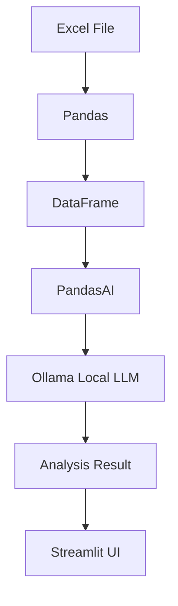

# Excel AI Analyzer

> Upload Excel files and analyze them using natural language with Local LLM.

## 프로젝트 소개

`Excel AI Analyzer`는 엑셀 데이터를 더 빠르게 이해하고 싶은 사용자를 위한 웹 서비스입니다.  
복잡한 함수나 피벗 테이블을 직접 만들지 않아도, 파일을 업로드한 뒤 질문만 입력하면 데이터 탐색·요약·집계를 진행할 수 있습니다.

- 해결하려는 문제: 엑셀 분석에 필요한 반복 작업과 높은 진입장벽
- 사용자가 할 수 있는 것: 업로드, 시트 선택, 미리보기, 자연어 질의, 결과 확인
- 분석 엔진: **PandasAI + Ollama** 기반 자연어 분석
- UI: **Streamlit** 기반 인터랙티브 웹 화면

## Preview


### 🏠 메인 화면


### 📂 파일 업로드


### 👀 데이터 미리보기


### 🤖 AI 분석 결과


## 주요 기능 (Features)

| Feature | Description |
| --- | --- |
| Excel Upload | `xlsx/xls` 파일 업로드 지원 |
| Multi File | 여러 파일 동시 업로드 및 파일별 분석 |
| Multi Sheet | 시트 선택 후 원하는 데이터 분석 |
| Data Preview | 업로드 데이터 미리보기 및 기본 요약 |
| AI Chat Analysis | 자연어 질문으로 필터·리스트·집계 분석 |
| Summary Command | `파일을 요약해줘` 명령으로 빠른 요약 |
| HTML Table Result | 분석 결과를 표 형태로 출력 |
| Bar Chart Render | 집계 결과 기반 막대 차트 생성 |
| Local LLM | Ollama 로컬 모델 연동 |
| Theme Toggle | Light / Dark 모드 전환 |

## Architecture



## Tech Stack

- **Frontend**
  - Streamlit
  - Custom CSS (Light/Dark Theme)
- **Backend**
  - Python
- **AI**
  - PandasAI
  - Ollama (Local LLM)
- **Data Processing**
  - pandas
  - openpyxl
- **Visualization**
  - matplotlib
  - HTML table rendering (Streamlit)

## Project Structure

```text
excel_ai_analyzer/
├── app.py
├── core/
├── ui/
├── profiles/
├── tests/
├── data/uploads/
├── exports/charts/
├── requirements.txt
└── run.sh
```

- `app.py`: Streamlit 앱 진입점
- `core/`: 엑셀 로딩, 자연어 분석, 요약/집계 등 핵심 로직
- `ui/`: 업로드/미리보기/채팅/사이드바 등 화면 구성
- `profiles/`: 컬럼 힌트 및 예산 표 모드 YAML 프로필
- `tests/`: 주요 로직 단위 테스트
- `data/uploads/`: 업로드 파일 임시 저장
- `exports/charts/`: 생성된 차트 파일 저장

## Quick Start

```bash
git clone https://github.com/Jihei-Boun/excel_ai_analyzer.git
cd excel_ai_analyzer
pip install -r requirements.txt
streamlit run app.py
```

기본 실행 포트는 `8502`, Ollama 기본 URL은 `http://localhost:11434`입니다.

## Example Prompts

- 파일을 요약해줘
- 연구활동비 합계를 알려줘
- 가장 큰 지출 항목은 무엇이야?
- 2024년 대비 증가한 항목을 보여줘
- 상위 10개 항목을 표로 보여줘
- 비용명이 121인 데이터만 보여줘
- 내부인건비 리스트로 정리해줘
- 파일별로 실행예산 합계를 비교해줘
- 파일별 실행예산 합계를 차트로 보여줘
- 집행률이 높은 순으로 정렬해줘

## Roadmap

### ✅ Completed

- [x] Excel Upload (`xlsx/xls`)
- [x] Multi File / Multi Sheet 분석
- [x] Data Preview
- [x] AI 자연어 분석 (PandasAI + Ollama)
- [x] 파일 요약 명령 지원
- [x] 집계 결과 표/막대 차트 출력
- [x] Light / Dark Theme

### 🚀 Planned

- [ ] CSV 업로드 지원
- [ ] PDF 데이터 입력 지원
- [ ] 여러 파일 간 자동 비교 리포트
- [ ] 차트 유형 확장 (라인/파이 등)
- [ ] 분석 결과 Export 강화 (리포트 템플릿)

---

저장소: [Jihei-Boun/excel_ai_analyzer](https://github.com/Jihei-Boun/excel_ai_analyzer)
